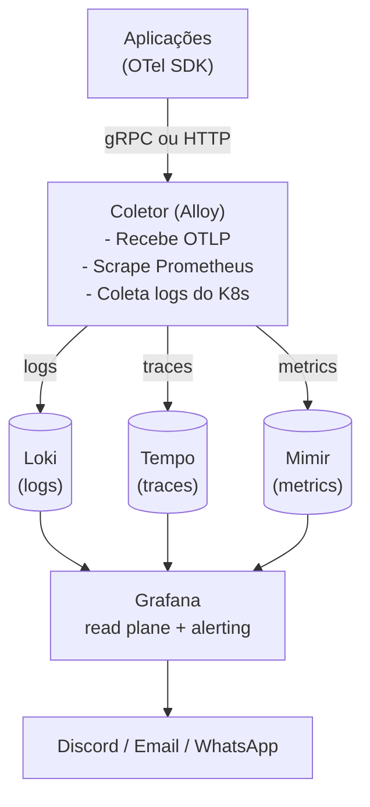
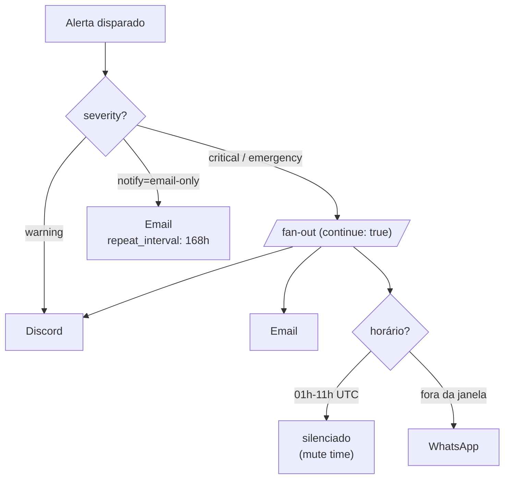

Recentemente passei pela experiência de melhorar a arquitetura de observabilidade da empresa em que trabalho, a [Woovi](https://woovi.com/). Toda a stack roda **self-hosted** dentro do nosso próprio cluster Kubernetes, sem depender de SaaS como Datadog, New Relic ou Grafana Cloud. Isso traz um custo de operação maior, mas garante que dados sensíveis (logs de transações financeiras, traces de pagamento) nunca saiam da nossa infraestrutura.

Neste post vou focar em como funcionam as peças da arquitetura, como elas se conectam, e principalmente como configuramos os alertas no Grafana para que o time seja avisado quando algo sai do esperado. Deixarei de lado as configurações específicas da Woovi e focarei nos conceitos que funcionam em qualquer empresa.

## Os 3 pilares da observabilidade

Antes de qualquer coisa, é importante entender o que estamos coletando. Existem 3 tipos principais de telemetria:

- **Logs**: mensagens textuais geradas pela aplicação. Útil para entender o que aconteceu em um momento específico.
- **Métricas**: valores numéricos agregados ao longo do tempo (latência, número de requisições, uso de CPU). Útil para entender tendências.
- **Traces**: registro de uma requisição percorrendo múltiplos serviços. Útil para encontrar gargalos em sistemas distribuídos.

Existe ainda um quarto pilar emergente, que é o **profiling contínuo** (ex: Pyroscope), mas vamos focar nos 3 principais.

> Cada pilar precisa de um backend de armazenamento diferente, porque os padrões de leitura e escrita são bem distintos. Métricas são séries temporais com cardinalidade controlada, logs são texto com alta variabilidade, e traces são árvores de spans.

## Visão geral da arquitetura

A arquitetura segue um padrão bem comum no ecossistema Grafana, com um **único ponto de entrada** que recebe toda a telemetria das aplicações e distribui para os backends apropriados.



Toda essa stack roda dentro do mesmo cluster Kubernetes que executa as aplicações. O armazenamento de longo prazo fica em um **MinIO** (S3 compatível) também self-hosted, garantindo que nenhum dado de telemetria saia da nossa infraestrutura.

## OpenTelemetry como padrão

A escolha mais importante de toda a arquitetura é adotar o **OpenTelemetry (OTel)** como padrão de instrumentação. Antes de adotá-lo, é comum cada aplicação ter sua própria forma de gerar telemetria, com bibliotecas diferentes, formatos diferentes e endpoints diferentes.

O OTel padroniza isso. As aplicações exportam telemetria em um formato chamado **OTLP** (OpenTelemetry Protocol), que pode ser enviado via gRPC ou HTTP. As variáveis de ambiente padrão são:

```sh
OTEL_EXPORTER_OTLP_ENDPOINT=http://collector:4318
OTEL_EXPORTER_OTLP_PROTOCOL=http/protobuf
OTEL_SERVICE_NAME=meu-servico
OTEL_TRACES_EXPORTER=otlp
OTEL_METRICS_EXPORTER=otlp
OTEL_LOGS_EXPORTER=otlp
```

Com isso, toda aplicação envia logs, métricas e traces para o mesmo endpoint. Trocar o backend (sair de uma cloud para self-hosted, por exemplo) vira uma questão de mudar o coletor, sem alterar nenhuma linha de código da aplicação.

> Esse desacoplamento é o principal benefício do OTel. Você não fica preso a um vendor.

## O coletor: Grafana Alloy

O coletor é o componente que recebe a telemetria e roteia para o backend correto. A gente usa o [Grafana Alloy](https://grafana.com/oss/alloy-opentelemetry-collector/), que é um fork do OpenTelemetry Collector com algumas funcionalidades extras (compatibilidade com Prometheus, scraping de logs do Kubernetes via CRD, etc).

### Por que ter um coletor no meio ?

Por que não enviar direto da aplicação para o Loki/Tempo/Mimir? Existem várias razões:

1. **Buffering e retry**: se o backend está temporariamente indisponível, o coletor segura os dados ao invés de perder. A aplicação não precisa se preocupar com isso.
2. **Enriquecimento**: o coletor pode adicionar metadados que a aplicação não tem (nome do nó, namespace do Kubernetes, ambiente, cluster).
3. **Filtragem e amostragem**: dá para decidir quais traces guardar, descartar logs ruidosos, agregar métricas antes de mandar para o storage. Tudo em um lugar central.
4. **Conversão de formatos**: o coletor recebe OTLP da aplicação e converte para o formato nativo de cada backend (Loki, Prometheus remote-write, Tempo).
5. **Single point of configuration**: trocar de backend vira uma mudança em um arquivo só.

### Pipelines

O Alloy é configurado em pipelines. Cada pipeline define uma cadeia de processamento. Um exemplo simplificado para traces:

```alloy title=alloy-config.river
otelcol.receiver.otlp "default" {
  grpc { endpoint = "0.0.0.0:4317" }
  http { endpoint = "0.0.0.0:4318" }
  output {
    traces = [otelcol.processor.k8sattributes.default.input]
  }
}

otelcol.processor.k8sattributes "default" {
  output {
    traces = [otelcol.processor.batch.default.input]
  }
}

otelcol.processor.batch "default" {
  output {
    traces = [otelcol.exporter.otlp.tempo.input]
  }
}

otelcol.exporter.otlp "tempo" {
  client {
    endpoint = "tempo-distributor:4317"
    tls { insecure = true }
  }
}
```

A telemetria flui receiver → processors → exporter. Cada componente é um plugin independente, e dá para criar pipelines arbitrariamente complexos.

### Span metrics

Um truque importante é o conector de **span metrics**. Ele transforma traces em métricas RED (Rate, Errors, Duration) automaticamente. Toda vez que uma aplicação manda um trace, o coletor calcula latência, contador de erros, e exporta como métrica. Isso é o que alimenta os alertas de latência mais à frente.

```alloy title=spanmetrics.river
otelcol.connector.spanmetrics "default" {
  histogram {
    explicit {
      buckets = ["50ms", "100ms", "250ms", "500ms", "1s", "2s", "5s", "10s"]
    }
  }
  dimension { name = "http.method" }
  dimension { name = "http.status_code" }
}
```

Sem isso, você precisaria instrumentar manualmente cada endpoint para emitir métricas de latência. Com o conector, isso vem de graça a partir dos traces.

## Backends de storage

Cada pilar tem um backend dedicado, e todos seguem o mesmo padrão arquitetural: separação entre **escrita**, **leitura** e **storage de longo prazo** em S3.

### Loki para logs

O Loki é "Prometheus para logs". Ao invés de indexar todo o conteúdo do log (como faz o Elasticsearch), ele só indexa **labels** (`service`, `namespace`, `severity`). O conteúdo do log fica em chunks comprimidos no S3.

Isso traz dois benefícios:
- **Custo de storage muito menor** (chunks comprimidos no S3 vs índice invertido em disco).
- **Cardinalidade controlada**, porque labels são poucos e limitados. Você não pode usar um `request_id` ou `trace_id` como label, senão o índice explode.

Para campos que mudam a cada requisição (como `trace_id`), o Loki tem o conceito de **structured metadata**, que é guardado dentro do chunk e pesquisável, mas não indexado. É a melhor de duas opções: dá para filtrar por `trace_id`, sem matar a cardinalidade.

> A regra de ouro do Loki: labels para coisas com baixa cardinalidade (até umas centenas de valores únicos), structured metadata para o resto.

### Tempo para traces

Tempo é um backend de traces que armazena tudo em S3. A grande sacada é que ele **não tem índice** sobre o conteúdo dos spans. Ao invés disso, o Tempo confia no **trace_id** como chave primária e usa formatos colunares (Parquet) para queries complexas (TraceQL).

Para queries que precisam ser performáticas, dá para configurar **dedicated columns** com atributos de span que aparecem com frequência em filtros (no nosso caso, IDs de negócio). Isso transforma o atributo em uma coluna nativa do Parquet, ao invés de ficar dentro de um campo JSON genérico.

O Tempo também tem o que chamam de **metrics-generator**, que cumpre uma função similar ao spanmetrics do coletor: transformar spans em métricas em tempo de ingestão. Acabamos usando os dois (metrics-generator do Tempo e spanmetrics do Alloy), mas o ideal é escolher um e ficar com ele para evitar séries duplicadas.

### Mimir para métricas

O Mimir é um Prometheus distribuído com storage em S3. A API é 100% compatível com o Prometheus, então qualquer ferramenta que fala PromQL funciona sem modificação.

A diferença principal está na escala. O Prometheus tradicional roda como uma instância única e guarda dados em disco local. O Mimir é horizontalmente escalável (você adiciona réplicas conforme cresce) e tem retenção de meses ou anos no S3, ao invés de poucos dias.

A gente usa o protocolo **remote-write** para mandar as métricas do Alloy para o Mimir:

```alloy title=remote-write.river
prometheus.remote_write "mimir" {
  endpoint {
    url = "http://mimir-gateway/api/v1/push"
  }
}
```

> Para entender quais tipos de métrica existem (Counter, Gauge, Histogram, Summary) e como escolher o tipo certo na hora de instrumentar, escrevi um post complementar: [Métricas do Prometheus no /metrics e quando usar cada uma](https://www.phpeterle.com/posts/prometheus-metrics-types/).

## Grafana como read plane

O Grafana é o ponto único de entrada para visualização. Ele se conecta nos 3 backends como datasources separados:

```yaml title=values-datasources.yaml
datasources:
  - name: Mimir
    type: prometheus
    uid: prometheus
    isDefault: true
    url: http://mimir-gateway/prometheus
  - name: Loki
    type: loki
    uid: loki
    url: http://loki-gateway
  - name: Tempo
    type: tempo
    uid: tempo
    url: http://tempo-query-frontend:3200
```

### Correlação entre datasources

A parte mais legal do Grafana é a **correlação automática** entre os 3 pilares. Configurando os datasources corretamente, você consegue:

- **Logs → Traces**: clicar em um log e abrir o trace correspondente, usando o `trace_id` que está nos campos estruturados.
- **Traces → Logs**: clicar em um span e ver os logs que ele gerou, filtrando pelo `service.name` e janela de tempo do span.
- **Métricas → Traces**: clicar em um spike de latência em um dashboard e abrir os traces daquele período (Exemplars).

Isso é configurado nos `derivedFields` do Loki e no `tracesToLogsV2` do Tempo:

```yaml title=values-datasources.yaml
- name: Loki
  jsonData:
    derivedFields:
      - name: trace_id
        matcherType: regex
        matcherRegex: '"trace_id":"([a-f0-9]+)"'
        url: '$${__value.raw}'
        datasourceUid: tempo
- name: Tempo
  jsonData:
    tracesToLogsV2:
      datasourceUid: loki
      tags:
        - key: service.name
          value: service_name
```

> Essa correlação é o que torna a debugging em produção muito mais rápida. Você sai de uma métrica, vai para o trace, e do trace para os logs em segundos.

## Sidecar para dashboards

O Grafana tem dois jeitos de provisionar dashboards: pela UI (que salva no SQLite interno) ou via arquivo (file-based provisioning). O segundo é melhor porque permite versionar os dashboards no Git, mas tem um problema: você precisa fazer rollout do Grafana toda vez que adiciona um dashboard.

A solução é o **sidecar pattern** com o [kiwigrid/k8s-sidecar](https://github.com/kiwigrid/k8s-sidecar). É um container que roda lado a lado com o Grafana, observa o cluster Kubernetes em busca de **ConfigMaps com uma label específica**, e quando encontra um, copia o conteúdo para uma pasta do Grafana. O Grafana, por sua vez, observa essa pasta e carrega os novos dashboards em tempo real.

```yaml title=grafana-values.yaml
sidecar:
  dashboards:
    enabled: true
    label: grafana_dashboard
    labelValue: "1"
    folderAnnotation: grafana_folder
    searchNamespace: ALL
```

A partir desse momento, qualquer ConfigMap no cluster com a label `grafana_dashboard: "1"` vira um dashboard automaticamente. Para criar um dashboard novo, basta:

```yaml title=meu-dashboard.yaml
apiVersion: v1
kind: ConfigMap
metadata:
  name: meu-dashboard
  labels:
    grafana_dashboard: "1"
  annotations:
    grafana_folder: "Aplicacoes"
data:
  dashboard.json: |
    { ... json do dashboard ... }
```

Aplicar com `kubectl apply -f` e o dashboard aparece no Grafana em segundos. Sem rollout, sem restart. O time inteiro consegue contribuir com dashboards sem mexer na configuração do Grafana.

> O mesmo padrão funciona para datasources e plugins, basta mudar a label.

## Alertas: a parte mais importante

Coletar telemetria sem alertas é só dashboard bonito. O valor real vem de **ser notificado quando algo está fora do esperado**, sem precisar ficar olhando dashboard.

O Grafana tem um sistema de alerting unificado (Unified Alerting) que substituiu o Alertmanager tradicional. Ele tem 3 conceitos principais:

1. **Rules**: a regra que define o que monitorar (uma query PromQL/LogQL/TraceQL + um threshold).
2. **Contact points**: para onde mandar a notificação (email, Discord, WhatsApp, PagerDuty, webhook).
3. **Notification policies**: como rotear cada alerta para os contact points corretos baseado em labels.

### Definindo regras

Uma regra de alerta é um query que roda em intervalos definidos. Se o resultado bate o threshold por mais de X minutos, o alerta dispara.

Exemplo de alerta para latência p95:

```yaml title=values-alerting.yaml
groups:
  - name: latency
    folder: Latency
    interval: 1m
    rules:
      - title: API checkout p95 > 5s
        condition: C
        data:
          - refId: A
            datasourceUid: prometheus
            model:
              expr: |
                histogram_quantile(0.95,
                  sum by (le) (
                    rate(traces_spanmetrics_duration_milliseconds_bucket{
                      service_name="api",
                      span_name="POST /checkout"
                    }[5m])
                  )
                )
          - refId: B
            datasourceUid: __expr__
            model:
              type: reduce
              expression: A
              reducer: last
          - refId: C
            datasourceUid: __expr__
            model:
              type: threshold
              expression: B
              conditions:
                - evaluator:
                    type: gt
                    params: [5000]
        for: 5m
        labels:
          severity: critical
        annotations:
          summary: "Latência p95 do checkout acima de 5s"
```

Repare que o alerta usa `traces_spanmetrics_duration_milliseconds_bucket`, que é exatamente a métrica gerada pelo coletor a partir dos traces. Sem instrumentar nada na aplicação, conseguimos alertar em latência por endpoint.

### Contact points

Os contact points definem para onde a notificação vai. Configuramos múltiplos canais para diferentes severidades:

```yaml title=values-contactpoints.yaml
contactPoints:
  - name: discord-alerts
    receivers:
      - type: discord
        settings:
          url: ${DISCORD_WEBHOOK_URL}
  - name: whatsapp-alerts
    receivers:
      - type: webhook
        settings:
          url: ${EVOLUTION_API_URL}
          httpMethod: POST
  - name: email-alerts
    receivers:
      - type: email
        settings:
          addresses: oncall@empresa.com
```

O WhatsApp em específico é interessante porque o Grafana não tem integração nativa, mas dá para usar um webhook que chama uma API como a [Evolution API](https://github.com/EvolutionAPI/evolution-api) (também self-hosted) que manda mensagens para um grupo de WhatsApp.

### Notification policies: roteamento por severidade

Aqui está a parte arquitetural mais importante. Não queremos que **todo alerta** vá para todos os canais. Um alerta de queue de baixa prioridade não precisa acordar ninguém às 3 da manhã.

A solução é criar uma hierarquia de roteamento baseada em **labels**:

```yaml title=values-contactpoints.yaml
policies:
  - receiver: discord-alerts
    group_by: [alertname, namespace]
    routes:
      - matchers: [notify=email-only]
        receiver: email-alerts
        repeat_interval: 168h
      - matchers: [severity=~"critical|emergency"]
        continue: true
        receiver: whatsapp-alerts
        mute_time_intervals: [nighttime]
      - matchers: [severity=~"critical|emergency"]
        continue: true
        receiver: email-alerts
      - matchers: [severity=~"critical|emergency"]
        receiver: discord-alerts
```

A lógica fica mais clara visualmente:



A lógica é:
- Por padrão, todo alerta cai no Discord (ruído baixo, time vê quando estiver online).
- Se a severidade for `critical` ou `emergency`, dispara em **3 canais simultâneos** (Discord, Email, WhatsApp).
- WhatsApp tem mute time durante a madrugada para alertas que podem esperar, mas Discord e Email continuam disparando.
- Alertas marcados com `notify=email-only` (ex: warnings de infra) só vão para email com `repeat_interval` longo.

> O `continue: true` é importante: sem ele, o alerta para no primeiro match. Com ele, o roteamento continua avaliando as outras policies.

### Severity matters

O vocabulário de severidade que usamos é:

- `warning`: algo precisa de atenção, mas não está quebrando produção. Vai só para Discord.
- `critical`: algo está quebrado ou prestes a quebrar. Notifica todos os canais.
- `emergency`: produção fora do ar. Notifica todos os canais, sem mute time.

A diferença entre `critical` e `emergency` é justamente o respeito (ou não) ao mute time noturno. Um banco de dados saturando às 3 da manhã pode ser `critical` (espera até de manhã), mas um site fora do ar é `emergency` (acorda quem precisa).

### YAML anchors para evitar duplicação

Como cada regra de alerta tem uma estrutura repetitiva (data, expressão de redução, threshold), a gente usa **YAML anchors** para reaproveitar blocos:

```yaml title=values-alerting.yaml
x-anchors:
  - &latency-base
    condition: C
    for: 5m
    isPaused: false
  - &reduce-data
    refId: B
    datasourceUid: __expr__
    model:
      type: reduce
      expression: A
      reducer: last

groups:
  - name: latency
    rules:
      - <<: *latency-base
        title: API checkout p95 > 5s
        data:
          - refId: A
            ... # query
          - <<: *reduce-data
          - refId: C
            ... # threshold
```

Isso reduz drasticamente a quantidade de YAML e evita inconsistências entre regras.

## O que fica fora do escopo deste post

Para quem quer ir mais a fundo, alguns tópicos que mereciam um post próprio:

- **Profiling contínuo** com Pyroscope (o quarto pilar)
- **Service graphs** automáticos a partir de traces
- **Exemplars** (linkar ponto específico de uma métrica para o trace que o gerou)
- **Cost monitoring**: como medir e controlar o custo de telemetria (cardinalidade, retenção)
- **High availability**: réplicas, anti-affinity, zona-aware replication

## Conclusão

Montar uma stack de observabilidade self-hosted dá trabalho, mas tem benefícios claros:
- **Custo previsível** (você paga storage e compute, não por GB ingerido).
- **Privacidade** (dados sensíveis nunca saem da sua infra).
- **Flexibilidade** (você customiza qualquer parte da stack).

A arquitetura padrão do ecossistema Grafana (OTel SDK → coletor → Loki/Tempo/Mimir → Grafana) é robusta, bem documentada, e funciona em qualquer escala. O sidecar pattern para dashboards e o sistema de alerting unificado tornam a operação muito mais simples do que parece à primeira vista.

A parte mais importante de toda a stack não é a coleta, é o **alerting**. Sem alertas bem configurados, observabilidade vira só um custo. Com alertas bem configurados, vira a diferença entre descobrir um problema antes do cliente ou depois dele.

## Referências

- [OpenTelemetry Documentation](https://opentelemetry.io/docs/)
- [Grafana Alloy](https://grafana.com/docs/alloy/latest/)
- [Loki Architecture](https://grafana.com/docs/loki/latest/get-started/architecture/)
- [Tempo Documentation](https://grafana.com/docs/tempo/latest/)
- [Mimir Documentation](https://grafana.com/docs/mimir/latest/)
- [kiwigrid/k8s-sidecar](https://github.com/kiwigrid/k8s-sidecar)
- [Métricas do Prometheus no /metrics e quando usar cada uma](https://www.phpeterle.com/posts/prometheus-metrics-types/) — documentação complementar sobre tipos de métricas
