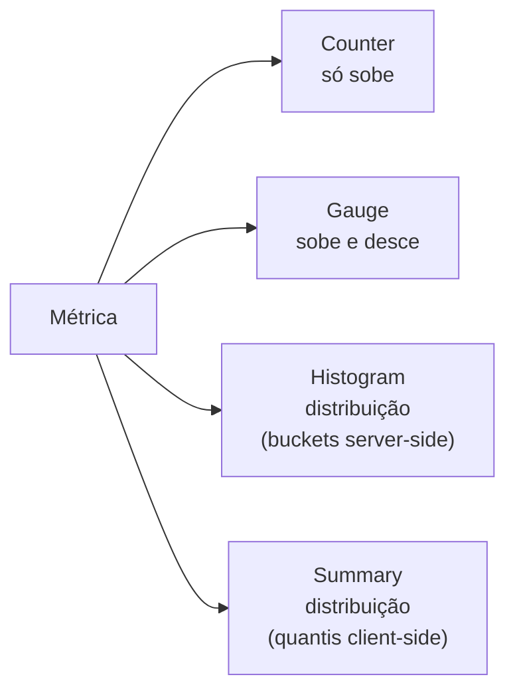
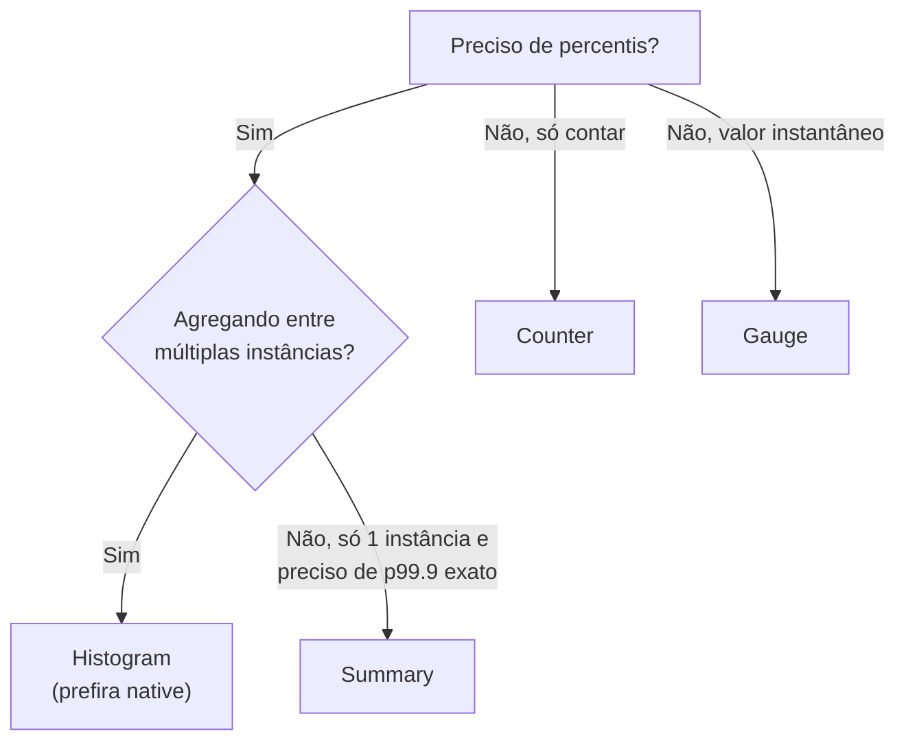

Quem já trabalhou com Prometheus, Mimir ou qualquer ferramenta do ecossistema sabe que tudo começa em um endpoint HTTP simples chamado `/metrics`. A aplicação expõe um arquivo de texto, o coletor faz scrape em intervalos regulares, e cada linha vira uma série temporal. Esse contrato simples é a base de toda a observabilidade baseada em métricas.

O que muita gente não sabe é que existem **4 tipos de métricas** diferentes, e escolher o tipo errado leva a alertas que não disparam, dashboards que mentem ou cardinalidade explosiva. Neste post vou explicar como o `/metrics` funciona por baixo dos panos e quando usar Counter, Gauge, Histogram ou Summary.

## Anatomia do /metrics

Antes de qualquer coisa, vale ver o que sai de fato no endpoint. O formato é o **OpenMetrics** (uma evolução do exposition format original do Prometheus), e cada métrica tem 3 partes: `# HELP` (descrição), `# TYPE` (tipo) e as séries propriamente ditas.

```text title=/metrics
# HELP http_requests_total Total de requisições HTTP recebidas
# TYPE http_requests_total counter
http_requests_total{method="GET",status="200"} 1547
http_requests_total{method="POST",status="201"} 89
http_requests_total{method="GET",status="500"} 3

# HELP process_resident_memory_bytes Memória residente em bytes
# TYPE process_resident_memory_bytes gauge
process_resident_memory_bytes 4.2598400e+07

# HELP http_request_duration_seconds Latência das requisições
# TYPE http_request_duration_seconds histogram
http_request_duration_seconds_bucket{le="0.1"} 1430
http_request_duration_seconds_bucket{le="0.5"} 1520
http_request_duration_seconds_bucket{le="1.0"} 1540
http_request_duration_seconds_bucket{le="+Inf"} 1547
http_request_duration_seconds_sum 187.3
http_request_duration_seconds_count 1547
```

Cada combinação de `nome + labels` é uma **série temporal** independente. O scrape do Prometheus pega esse snapshot a cada 15-30s e armazena com timestamp.

> Ponto importante: o `/metrics` mostra sempre o **valor atual** (cumulativo, no caso de counters). O Prometheus calcula taxas e diferenças no momento da query, não no momento da coleta.

## Os 4 tipos de métrica



A escolha entre eles depende do que você quer responder: contar eventos, medir um valor instantâneo ou entender a distribuição de uma medição.

## Counter

Um **counter** é uma métrica que só aumenta (ou reseta para zero quando o processo reinicia). É o tipo mais comum e o mais usado para contar eventos.

```text
# TYPE http_requests_total counter
http_requests_total{status="200"} 1547
```

A regra é simples: se a pergunta for "quantas vezes X aconteceu?", é counter. Convencionalmente, o nome termina em `_total`.

### Quando usar

- Número total de requisições HTTP
- Número de erros, exceções, retries
- Bytes enviados/recebidos
- Mensagens publicadas/consumidas em uma fila
- Jobs processados

### O que NÃO fazer

Você quase nunca quer plotar o valor bruto de um counter. O número só cresce, então o gráfico vira uma linha que sobe para sempre. O que você quer é a **taxa** desse counter:

```promql
# Requisições por segundo nos últimos 5 minutos
rate(http_requests_total[5m])

# Erros por segundo, quebrados por endpoint
sum by (endpoint) (rate(http_requests_total{status=~"5.."}[5m]))

# Taxa de erro (erros / total)
sum(rate(http_requests_total{status=~"5.."}[5m]))
/
sum(rate(http_requests_total[5m]))
```

`rate()` lida automaticamente com resets do counter (deploy, crash) e retorna unidades por segundo. Para janelas mais curtas em alertas, existe `irate()`.

> Se você se pegar criando uma métrica chamada `requests_per_second` e fazendo o cálculo na aplicação, **pare**. Exporte um counter `requests_total` e deixe o Prometheus calcular a taxa. Isso evita dupla agregação e dá flexibilidade para escolher a janela depois.

## Gauge

Um **gauge** é um valor que pode subir e descer livremente. É um snapshot do "agora".

```text
# TYPE goroutines_count gauge
goroutines_count 42

# TYPE queue_depth gauge
queue_depth{queue="emails"} 17
```

### Quando usar

- Uso de memória, CPU, disco
- Temperatura, voltagem
- Profundidade de fila
- Número de conexões ativas
- Número de pods rodando
- Posição em uma fila do Kafka (lag)

### Funções úteis

Diferente do counter, o valor bruto faz sentido. Você plota direto. Para análises mais sofisticadas:

```promql
# Variação nos últimos 5 minutos (positiva = subindo, negativa = descendo)
delta(queue_depth[5m])

# Taxa de variação por segundo
deriv(queue_depth[5m])

# Valor máximo no último 1h, agrupado por fila
max_over_time(queue_depth[1h])
```

> Pegadinha comum: usar `rate()` em gauge não faz sentido (e o Prometheus não vai te avisar). Se a métrica é "número de pods", `rate()` te dá "pods criados por segundo", que provavelmente não é o que você queria.

## Histogram

Aqui as coisas ficam interessantes. Um **histogram** mede a distribuição de valores observados, agrupando em **buckets** pré-definidos. É o tipo certo para latência, tamanho de payload e qualquer medição em que você queira percentis.

```text
# TYPE http_request_duration_seconds histogram
http_request_duration_seconds_bucket{le="0.05"} 24054
http_request_duration_seconds_bucket{le="0.1"}  33444
http_request_duration_seconds_bucket{le="0.25"} 100392
http_request_duration_seconds_bucket{le="0.5"}  129389
http_request_duration_seconds_bucket{le="1.0"}  133988
http_request_duration_seconds_bucket{le="+Inf"} 144320
http_request_duration_seconds_sum 53423.1
http_request_duration_seconds_count 144320
```

Note que o histogram gera **3 séries diferentes**:

1. `_bucket{le="..."}`: counter cumulativo de observações abaixo de cada limite (`le` = "less than or equal").
2. `_sum`: soma de todos os valores observados.
3. `_count`: número total de observações (igual ao bucket `+Inf`).

### Calculando percentis

A grande sacada é que os buckets permitem calcular percentis no servidor, agregando entre múltiplas instâncias da aplicação:

```promql
# Latência p95 nos últimos 5 minutos
histogram_quantile(0.95,
  sum by (le) (rate(http_request_duration_seconds_bucket[5m]))
)

# Latência p99 quebrada por endpoint
histogram_quantile(0.99,
  sum by (le, endpoint) (rate(http_request_duration_seconds_bucket[5m]))
)

# Latência média (não é percentil, mas útil)
rate(http_request_duration_seconds_sum[5m])
/
rate(http_request_duration_seconds_count[5m])
```

A precisão do percentil depende dos buckets configurados. Se você só tem buckets em `[0.1, 1.0, 10.0]` e a maioria das requisições leva entre 100ms e 200ms, o `p95` vai ser uma interpolação grosseira dentro do bucket `0.1-1.0`. **Configure buckets que façam sentido para a sua distribuição.**

### Quando usar

- Latência de requisições HTTP/gRPC
- Tempo de execução de queries no banco
- Tamanho de payloads
- Tempo de processamento de jobs
- Qualquer coisa em que você queira p50, p95, p99

### Native histograms (Prometheus 2.40+)

A versão moderna do histogram não tem buckets fixos: o Prometheus mantém buckets exponenciais automaticamente, com resolução muito maior e cardinalidade muito menor. Se você está começando hoje em uma stack atualizada, vale ativar `--enable-feature=native-histograms`. A maioria dos SDKs do OpenTelemetry já suporta.

## Summary

Um **summary** também mede distribuição, mas calcula os quantis **dentro da aplicação** e exporta direto:

```text
# TYPE rpc_duration_seconds summary
rpc_duration_seconds{quantile="0.5"}  0.052
rpc_duration_seconds{quantile="0.9"}  0.198
rpc_duration_seconds{quantile="0.99"} 0.812
rpc_duration_seconds_sum 8421.3
rpc_duration_seconds_count 144320
```

À primeira vista parece mais conveniente: você já tem o p99 prontinho, sem precisar de `histogram_quantile()`. Na prática, summary tem uma limitação grave: **quantis não são agregáveis**.

> Você não pode somar p99 de duas instâncias para obter o p99 do conjunto. Não existe matemática que faça isso a partir dos quantis individuais — você precisa dos dados originais ou dos buckets.

Isso significa que se você roda 5 réplicas da sua API, cada uma exporta seu próprio p99, e o melhor que você consegue é a média ou o máximo desses p99s — nenhum dos dois é o verdadeiro p99 do conjunto.

### Quando usar Summary

Honestamente, em 95% dos casos: **não use**. Histogram é quase sempre melhor.

Os poucos casos em que summary faz sentido:

- Você precisa de quantis muito precisos (ex: p99.9) e tem só uma instância do serviço.
- Você sabe de antemão exatamente qual quantil quer e ele nunca vai mudar.
- A latência da operação varia em ordens de magnitude tão grandes que escolher buckets é inviável.

### Histogram vs Summary



Resumo brutal: se você está em dúvida, **escolha histogram**.

## Cardinalidade: o pé no freio

Cada combinação única de `nome + labels` é uma série temporal nova. E isso custa memória, disco e dinheiro.

```text
# RUIM — cardinalidade explosiva
http_requests_total{user_id="123", request_id="abc-def-...", path="/api/users/123"} 1
```

Com `user_id` e `request_id` como labels, você tem potencialmente **milhões** de séries. Cada série consome memória no Prometheus e cresce indefinidamente.

### Regras de ouro

- **Labels com baixa cardinalidade**: `method`, `status`, `endpoint` (depois de normalizado), `region`, `service`. Idealmente até algumas centenas de valores únicos.
- **NUNCA labels**: `user_id`, `request_id`, `trace_id`, `email`, conteúdo de URL com IDs (`/api/users/123` em vez de `/api/users/:id`).
- **Para correlacionar com requisições específicas**: use **logs** (Loki) ou **traces** (Tempo). Métrica é para tendências agregadas.

> Uma boa heurística: se o valor do label muda em quase toda requisição, ele não devia ser um label.

### Estimando o custo

O total de séries de uma métrica é o produto da cardinalidade de cada label. Por exemplo:

```text
http_requests_total{
  method,    # 5 valores (GET, POST, ...)
  endpoint,  # 50 valores
  status     # 10 valores
}
# = 5 * 50 * 10 = 2500 séries
```

Adicionar `region` (3 valores) leva a 7500 séries. Adicionar `user_id` (1 milhão) leva a... bem, você entendeu.

## Convenções de nomenclatura

O Prometheus tem convenções fortes que valem seguir:

- **Snake_case**: `http_requests_total`, não `httpRequestsTotal`.
- **Counters terminam em `_total`**: `errors_total`, não `errors`.
- **Unidades em segundos e bytes**: prefira `_seconds` e `_bytes` no nome, não `_milliseconds` ou `_kilobytes`. O Grafana sabe formatar.
- **Sufixo da unidade no nome**: `request_duration_seconds`, `payload_size_bytes`.
- **Prefixo do componente**: `http_*`, `db_*`, `kafka_*`.

```text
# Bom
http_request_duration_seconds_bucket{...}
db_connections_open
kafka_consumer_lag_messages

# Ruim
HTTPLatencyMs{...}
db_conns
lag
```

## Resumo

| Tipo          | Para o quê                       | Funções comuns               | Cuidados                                 |
| ------------- | -------------------------------- | ---------------------------- | ---------------------------------------- |
| **Counter**   | Contar eventos                   | `rate()`, `increase()`       | Sempre `_total`, não plote o valor bruto |
| **Gauge**     | Valor instantâneo                | direto, `delta()`, `deriv()` | Não use `rate()`                         |
| **Histogram** | Distribuição agregável           | `histogram_quantile()`       | Buckets bem escolhidos                   |
| **Summary**   | Percentis precisos sem agregação | direto via label `quantile`  | Não agrega entre instâncias              |

## Conclusão

Os 4 tipos do Prometheus parecem semelhantes mas resolvem problemas diferentes. Na prática, **counter** e **histogram** cobrem a maioria absoluta dos casos: contadores para eventos, histograms para distribuições. Gauges entram quando você precisa de um valor instantâneo, e summary é raro o suficiente para ser tratado como caso especial.

A maior fonte de problemas em métricas não é escolher o tipo errado, e sim **cardinalidade descontrolada**. Métricas resolvem o problema "o que está acontecendo na média" — se você quer responder "o que aconteceu nessa requisição específica do cliente X", isso é trabalho de logs e traces, não de métricas.

Se você está começando uma stack nova, considere:

- Padronizar instrumentação via OpenTelemetry (que já segue convenções do Prometheus).
- Ativar **native histograms** desde o início.
- Definir um padrão de labels permitidos no time, com revisão de cardinalidade no PR.

A diferença entre uma stack de métricas que escala e uma que vira um pesadelo de custo geralmente está nessas escolhas iniciais.

## Referências

- [Prometheus — Metric types](https://prometheus.io/docs/concepts/metric_types/)
- [OpenMetrics specification](https://github.com/OpenObservability/OpenMetrics/blob/main/specification/OpenMetrics.md)
- [Prometheus naming conventions](https://prometheus.io/docs/practices/naming/)
- [Histogram vs Summary](https://prometheus.io/docs/practices/histograms/)
- [Native histograms](https://grafana.com/docs/mimir/latest/send/native-histograms/)
